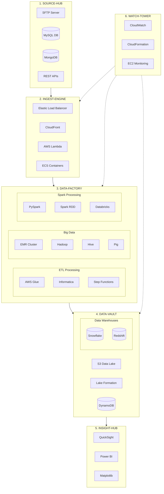

# E-commerce Analytics Platform - Detailed Architecture

## Architecture Diagram

## Layer Details

### 1. SOURCE-HUB (Data Sources)
- Purpose: Data ingestion from multiple sources
- Components:
  - SFTP Server: File transfers
  - MySQL DB: Transactional data
  - MongoDB: NoSQL data
  - REST APIs: Real-time data

### 2. INGEST-ENGINE (Data Ingestion)
- Purpose: Data collection and initial processing
- Components:
  - Elastic Load Balancer: Traffic distribution
  - CloudFront: Content delivery
  - AWS Lambda: Serverless processing
  - ECS Containers: Containerized services

[Continue with detailed descriptions of other layers...]